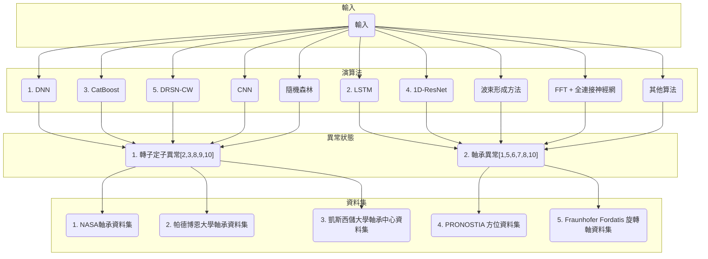

# 馬達相關論文研讀共同筆記

旨在提供一個論文研讀的共同筆記，方便團隊成員閱讀內容。

## 圖表

```markdown=    
## 異常狀態
- 1.轉子定子異常[2][3][8][9][10]
- 2.軸承異常 [1][5][6][7][8][10]

## 使用輸入
- 1.振動[1][6][8][9]
- 2.三相電流[1][2][7][8][9][10]
> 時域定子電流分割成重疊的序列，每個序列被視為獨立的虛擬電流感測器測量值
- 3.同步旋轉速度、轉子滑移值、所有故障頻率的幅值估計、均方根值和峰值因子值[4]
- 4.時域特徵如均值、標準差、偏度、峰度等[5]
- 5.輸入電壓、測得的RPM[6]
- 6.軸承的徑向力、扭矩、轉速和其他相關參數

## 演算法
- 1.DNN [4]
- 2.LSTM [1]
- 3.CatBoost [5]
- 4.1D-ResNet[1]
- 5.DRSN-CW[1]
- 6.最小方差波束形成方法生成穩定的電流頻率譜來檢測和識別故障[2][10]
- 7.CNN [6]
- 8.FFT + 全連接神經網 [6]
- 9.隨機森林[6]
- 10.CART、BT、NN、SVM-PSO、ELM、kNN和集成算法[7]
- 11.功率頻譜密度（PSD）的振幅來進行診斷[8]
- 12.快速峰度圖和自動圖用於振動信號的分析[9]
- 13.電流的三次諧波用於電流信號的分析。[9]
```

## 目錄

- [研讀論文列表](#研讀論文列表)
- [論文研讀紀錄](#論文研讀紀錄)
  - [論文1：One-Dimensional LSTM-Regulated Deep Residual Network for Data-Driven Fault Detection in Electric Machines](#one-dimensional-lstm-regulated-deep-residual-network-for-data-driven-fault-detection-in-electric-machines) - Min-Fu Hsieh 2024
  - [論文2：Online Detection of Induction Motor’s Stator Winding Short-Circuit Faults](#online-detection-of-induction-motors-stator-winding-short-circuit-faults) - Min-Fu Hsieh 2014
  - [論文3：Assessing Energy Efficiency and Power Quality Impacts Due to High-Efficiency Motors Operating Under Nonideal Energy Supply](#assessing-energy-efficiency-and-power-quality-impacts-due-to-high-efficiency-motors-operating-under-nonideal-energy-supply) - CEAMAZON 2021
  - [論文4： Fault Diagnosis in Dynamic Systems Using Distributed Neural Networks](#fault-diagnosis-in-dynamic-systems-using-distributed-neural-networks) - ICEEM 2023
  - [論文5：Explainable AI for Bearing Fault Detection Systems: Gaining Human Trust](#explainable-ai-for-bearing-fault-detection-systems-gaining-human-trust) - GCON 2023
  - [論文6：Machine Learning-Based Unbalance Detection of a Rotating Shaft Using Vibration Data](#machine-learning-based-unbalance-detection-of-a-rotating-shaft-using-vibration-data) - ETFA 2020
  - [論文7：Condition Monitoring of Bearing Damage in Electromechanical Drive Systems by Using Motor Current Signals of Electric Motors: A Benchmark Data Set for Data-Driven Classification](#condition-monitoring-of-bearing-damage-in-electromechanical-drive-systems-by-using-motor-current-signals-of-electric-motors-a-benchmark-data-set-for-data-driven-classification) - PHM, 2016
  - [論文8：Electric motors condition monitoring using currents and vibrations analyses ](#electric-motors-condition-monitoring-using-currents-and-vibrations-analyses) - ICEM, 2018
  - [論文9：An Effective Stator Fault Diagnosis Framework of BLDC Motor Based on Vibration and Current Signals](#an-effective-stator-fault-diagnosis-framework-of-bldc-motor-based-on-vibration-and-current-signals) - IEEE Access, 2020
  - [論文10：Robust motor current signature analysis (mcsa)-based fault detection under varying operating conditions](#robust-motor-current-signature-analysis-(mcsa)-based-fault-detection-under-varying-operating-conditions) - ICEMS, 2022


## 論文原文列表(原文摘要對應)

- [x] [論文1：One-Dimensional LSTM-Regulated Deep Residual Network for Data-Driven Fault Detection in Electric Machines](https://itrihq-my.sharepoint.com/:b:/g/personal/b20613_itri_org_tw/Eb78VWLnmlZAr9EDMNqEoSsBeo1dQ2IECybsa_72IKnWfw?e=RYWl6B) - Min-Fu Hsieh 2024
- [x] [論文2：Online Detection of Induction Motor’s Stator Winding Short-Circuit Faults](https://itrihq-my.sharepoint.com/:b:/g/personal/b20613_itri_org_tw/Ee5T2pmYQl9BnOCEvrxPpBYBksBPpkVFt1QGXGtJ-HdJ0g?e=t0ualC) - Min-Fu Hsieh 2014
- [] [論文3：]()
- [] [論文4：]()
- [] [論文5：]()
- [] [論文6：]()
- [] [論文7：]()
- [] [論文8：]()
- [] [論文9：]()
- [] [論文10：]()

## 論文研讀紀錄


### one-dimensional lstm regulated deep residual network for data driven fault detection in electric machines
    

#### 摘要

- 論文提出一種結合長短期記憶（LSTM）與深度殘差網絡的新型故障診斷模型，適用於電機故障檢測。此模型具備廣泛的故障類型適應性、高準確率的故障分類以及較快的收斂速度。
- 透過兩種數據集評估，
  - 測量三相電流的永磁同步電動機匝間短路故障
  - 凱斯西儲大學的軸承故障振動數據。
- 模型在測試中實現了100%的準確率，並展現出比其他網絡更快的訓練收斂性能。

#### I. 簡介

- 電機故障通常可分為三類：
  - 電氣故障（例如：匝間短路、相對地故障）
  - 機械故障（如軸承故障、偏心故障）
  - 磁性故障（如永磁同步電機的去磁）。
- 分析電機的任何類型故障時，會使用不同的測量或信號（例如：電流、振動、聲學）。
  - 基於模型的方法   (物理or數學模型)
  - 基於信號分析的方法  (提取特徵、分群、閥值)
    > 指定的指標本質上在不同的工作點下不起作用。
  - 基於數據驅動的方法  (AI)

- 傳統方法：
  - 分類器：如k-最近鄰、支持向量機、淺層神經網絡
  - 特徵工程需求：例如快速傅立葉變換、頻譜峭度分析

> 淺層分別是淺層神經網路，處理通常不夠複雜無法適應不同的情況。

- 現代深度學習方法：
  - 深度神經網絡：如卷積神經網絡、堆疊自編碼器
    > 針對非線性和複雜信號的適應性


- 深度殘差網絡（ResNet）的出現 (CNN變形)：
  - 限制：再探索新特徵的能力有限
  - 改進：深度殘差收縮網絡、多尺度核心基礎ResNet


- 針對不同情況的評估：
  - 不同故障和測量的通用性問題
  - 準確率與數據集依賴性

- 作者提出的方法：

  - 結構：深度殘差網絡結合卷積長短期記憶（LSTM）
  - 目標：提取時空信息、降低複雜度、增加通用性
  - 優點：快速收斂、小型訓練集


#### II. 一維 LSTM 調節的殘差網絡結構和定義

- 傳統殘差網絡(ResNet)的限制，重新探索新互補特徵的能力有限。
- 2D網路的某些特徵不必然適用於1D數據。

- 本研究開發的LSTM調節網路：
  - 針對1D數據進行改進。


- 網絡輸入：
  - 可以輸入多通道信號，如三相電流、不同位置的振動測量等。

- 網路結構：
  - 每層包含多個block。
  - 與傳統ResNet相比，使用了ReLU激活函數和長跳躍連接。

- 網路block結構：


應用單濾波器卷積操作和多濾波器卷積操作。
特徵圖與每個塊的隱藏狀態進行串聯。

- 特徵圖降採樣：

通過卷積操作降低計算時間，改善時間複雜度。

- 多濾波器卷積操作：
  - 針對一種資料類型(振動訊號)調參後，不適用其他資料(定子電流)
  - 三個具有不同核心大小、填充和膨脹的濾波器。
  - 減少濾波器參數的影響，特別是對於不同類型的數據。

- 卷積長短期記憶(ConvLSTM)：
  - 用於處理數據序列。
  - 提取特徵圖的時空信息，進而提取互補特徵。

- 長跳躍連接：
  - 減少了卷積跳躍連接的需要，降低了網絡複雜度。

- ReLU函數的減少使用：
  - 僅在Block的輸入使用一個ReLU函數，有助於加快網路收斂。
  
#### III. 故障檢測
- 使用的資料集：
  - 第一組：針對PMSM的三相電流中的ITSC故障的數據。
  - 第二組：CWRU軸承數據中心的實驗數據，測量電機不同軸承狀態下的振動。

- 故障和測量類型：
  - 包括機械故障和電氣故障，以及電流和振動兩種測量方式。

    - 網路輸入：
      - 電流作為三通道輸入，振動數據作為單通道輸入。
    
    - 資料類別：
      - 第一組數據有四個類別，第二組有12個類別。

    - 優化器和損失函數：
      - 使用隨機梯度下降優化器和類別交叉熵損失，學習率設定為0.001。

  - ITSC故障在PMSM中的影響：
    - ITSC故障是電機中常見的故障，可迅速導致其他故障。
    - 研究假設PMSM電機的A相匝間發生短路。

  - 故障模型：
    - 提出了受故障影響相位和健康相位的電壓方程。

  - 故障檢測實驗設置：
    - 展示了應用ITSC故障的實驗設置，包括電機驅動裝置和測量裝置。

  - 資料採集：
    - 採集了PMSM在健康狀態和不同級別ITSC故障下的三相電流數據。

  - 故障檢測方法的訓練和測試：
    - 對所提網絡進行了ITSC故障診斷測試。
    - 使用不同樣本數量進行訓練和測試。

  - 模型結構：
    - 提出的網路結構包括四層，每層具有不同數量的塊。

  - 軸承故障檢測：
    - 使用CWRU軸承故障數據集進行評估。
    - 考慮了不同類型的軸承故障，包括健康狀態、內圈故障、外圈故障和球故障。

  - 軸承故障的訓練和測試：
    - 對所提網絡進行了軸承故障診斷測試。
    - 使用不同樣本數量進行訓練和測試。

- 綜合評估：
  - 所提網絡在ITSC故障和軸承故障診斷中表現出色。
  - 與其他網絡相比，所提網絡具有更高的準確率和更廣泛的適用性。


#### IV. 結論

- 提出的LSTM調節網絡：
  - 用於電機故障診斷。

- 模型評估：
  - 通過兩種不同電機故障數據集（包含不同測量方式）進行檢驗。

- 總結結果和比較：
  - 提出的網絡在兩種不同故障和測量情況下能夠100%準確分類測試數據。這些數據包括PMSM的三相電流（針對ITSC故障）和感應電機的振動（針對軸承故障）。
  - 與其他類似網絡（包括1D-ResNet和DRSN-CW）相比，所提網絡收斂更快（計算時間與1D-ResNet幾乎相同，且少於DRSN-CW）。
  - LSTM調節網絡通過應用機制來提取互補特徵，從而在準確度和收斂性方面表現更佳。
  - 通過對ITSC故障數據集的1000個數據樣本的測試，證明了該方法即使在小型數據集上也能適當工作。

- 總體性能：
  - 所提網絡在電機故障檢測方面展現出良好的性能。
  - 在現實情況下，測量數據可能受到嚴重噪音的污染，且電機速度可能變化。因此，未來的工作將開發該網絡，以解決噪音問題，並能夠處理由於不同電機速度導致的不同長度數據。


### online detection of induction motors stator winding short circuit faults
> 線上檢測感應馬達定子繞組短路故障
#### 摘要

- 目的：開發一種新技術以檢測感應電動機定子繞組中的轉與轉間短路故障。
- 創新：模擬多於一相的轉與轉間短路及相對地面的故障。
> "相對地面的故障"可能是指故障發生在與地面有一定電壓差的位置。例如，如果一個電動機的定子繞組與地面之間出現了短路，那麼我們就可以說這是一個"相對地面的故障"
- 技術：使用從三相電流模式中提取的特徵。
- 功能：識別故障相位和故障嚴重性，也能檢測到相對地面的故障。
- 優勢：只需常見驅動系統中的電流感應器，不需機器設計細節。

#### I. 簡介

- 背景：三相感應電動機在工業過程中極為重要，但可能會出現故障導致失效。
- 統計：定子故障佔感應電機故障的26%-36%。
- 重點：定子轉與轉間故障被認為是大多數電機繞組故障的起始階段，因此其檢測受到廣泛關注。
- 挑戰：早期檢測轉與轉間短路故障至關重要，以避免進一步損壞和降低修理成本及停機時間。
- 目的：早期檢測三相感應電動機定子繞組中的轉與轉間短路故障，技術能檢測不同類型的轉與轉間短路故障，並識別故障嚴重性。


#### II. 感應電動機定子故障建模

- 目的與需求: 為了設計和評估故障診斷策略，需要理解基本物理問題，以找出與故障相關的特徵。
- 模型建立: 三相電機的模型展示了故障效應的包含，但存在複雜性與可靠性之間的權衡。
- 簡化假設: 提出的模型基於不同的簡化假設，使模型靈活。
- 模型應用: 使用模型來發展並分析定子故障檢測和識別策略，模型展示了具有單相定子繞組故障的感應電機的瞬態模型。
- 故障影響: 模型考慮了定子繞組中轉與轉間短路故障的影響。


#### III. 定子故障檢測與識別的提議策略

- 故障特徵提取: 三相電流模式轉換為特徵空間，為機器故障診斷技術的重要部分。
- 故障檢測系統概覽: 使用三相定子電流測量數據作為輸入數據。
- 特徵提取流程: 從3D電流定位中計算故障特徵，然後將選定的特徵提供給故障決策算法。
- 故障決策算法: 識別特定故障相位/相位並估計故障嚴重性。
- 基於3D橢圓的特徵比較: 將從3D電流定位的橢圓圖案與健康電機的圓形圖案進行比較。
- 故障相位識別: 使用最適合的3D橢圓來計算主要和次要軸長度及其主要方向。
- 嚴重性因素: 通過考慮橢圓的主次軸長來定義故障嚴重性因素，提供自動斷開電機的功能以避免嚴重損壞。

- (左)正常與故障的 3D 電流軌跡比較。
- (右)(a) 故障相「a」、「b」和「c」的 3-D 電流軌跡。 (b) 60°空間兩相 3-D 電流軌跡之間的位移。
- 相接地故障情況下的模擬結果、兩項故障實驗設置、相對地故障狀況的嚴重性係數特徵。

|正常vs異常|(a)|(b)|
|:-:|:-:|:--:|
||||
||||


#### IV. 實驗結果

- 試驗設備描述：使用特別改裝的三相鼠籠式感應電動機，進行實驗。實驗設置包括伺服馬達作為負載，通過彈性聯軸器和扭矩計連接到感應電動機。
- 試驗描述：透過測量三相電流，並從三維電流定位中提取特徵，以驗證模擬結果。實驗中記錄了三相電流樣本，並在特徵提取前過濾高頻成分。為避免電機繞組永久損壞，所有實驗均在降低供電電壓（220伏）和短時間內進行。
- 健康與故障操作：比較健康和故障電機條件下的三維電流定位。短路故障會使三維電流定位從圓形變為橢圓形。
- 故障嚴重性分析：探討不同故障嚴重性和不同負載扭矩下的三維電流定位。實驗結果顯示三維電流定位依賴於負載和故障嚴重性。
- 兩個故障相位的實驗結果：對於不同故障嚴重性和不同負載扭矩下的兩個故障相位進行了測試。這些測試用於檢測故障相位的位置。
- 實驗結果與模擬結果的比較：實驗結果與模擬結果略有不同，這可能是由於電機不對稱性、電源不平衡和模擬簡化所致。
- 結論：提出的策略通過模擬和實驗結果在不同故障和負載條件下得到驗證和驗證。


### assessing energy efficiency and power quality impacts due to high efficiency motors operating under nonideal energy supply

> 評估非理想能源供應下運轉的高效能馬達對能源效率和電能品質的影響 2021, IEEE Access
> 亞馬遜能源效率中心 (CEAMAZON)，帕拉聯邦大學

#### 摘要
- 高效電動機在非理想電網供電條件下運行，可能會對電網品質和能源效率產生影響。
- 三種電機類別的分析: 研究分析了三種0.75-kW電機類別：IE2、IE3和IE4，諧波失真的增加: 對於特定諧波失真的增加百分比，分析顯示在更高效率的電動機樣本中也會增加其他諧波。
- 電壓不平衡的影響: 對於大量的電壓不平衡，特別是在直啟式永磁電機IE4類別中，觀察到類似的反應。
- 高效能電動機在能源效率方面的性能可能因電能品質而降低。
- 本研究結果僅反映測試樣本的情況，不能泛化到所有電機類型。

> 諧波是一種會干擾電力系統正常運作的電壓或電流波形

#### I. 介紹

- 採用新技術的電動機更有效率，但在非理想電網條件下可能會影響電能質量。
- 高效率電動機的推出，如永磁電動機，改變了電動機技術的標準。
- 電動機效率的標準和分類: 電動機的效率，最初由IEC 60034-30-1在2008年分類，目前有四個效率等級IE1、IE2、IE3和IE4，預計下一版將定義IE5效率等級。

> IE1、IE2(94.2%)、IE3(95.2%)，2010年6月。
> IE4(96.1%)：目前被廣泛使用並被認為是高效率的電動機，2014年。
> IE5(96.9%)：中國的最新版三相異步電動機強制性國家標準GB 18613—2020在2020年5月發布，並在2021年6月1日起正式實施

- 研究發現諧波可能導致電動機中的額外損失，降低扭矩、增加噪聲、滑動和機械振動，從而提高電動機的內部溫度。
- 本研究將比較不同效率等級電動機在電壓諧波和不平衡情況下的能源效率增益與電能質量退化。


#### II. 能源效率政策

- 電動機技術的現代化和創新: 製造商為了達到更高的效率，超越了傳統的感應電動機，探索和完善了新技術，如銅轉子電機、同步磁阻電機和本研究中提到的永磁電機。

- 比較不同技術的經濟性和功率質量: 進行了在相同名義負載條件下的測量，比較了IE2、IE3和IE4等級電動機的總電流和功率。發現LSPMM（直啟式永磁電機）相比IE2和IE3等級電機，在總電流和總功率上有所降低。

#### III. 電壓不平衡與電壓諧波

- 電壓不平衡對電動機的負面影響: 電壓不平衡會對電動機能源供應產生重大負面影響。
- 電壓不平衡的三個主要組成部分: 電壓不平衡包括正、負和零序組分。在大多數三角形或不接地星形連接的電動機中，零序組分無路徑流向中性。
- 電壓不平衡對扭矩的影響: 正和負序組分產生不同的影響，其中一個貢獻於最終扭矩，而另一個則產生相反的磁場，導致更大的振動和速度降低。
- 電壓不平衡導致的定子電流不平衡: 通常電流不平衡是電壓不平衡的6到10倍，導致繞組過熱。
- 電壓不平衡因素分析: 電壓不平衡可能由多種因素引起，其中之一是由於不平等的相位負載條件導致的相位電壓不平衡。
- 電壓不平衡因子（VUF）的分析: VUF的概念用於分析電壓不平衡的狀況，計算中包括正和負序電壓。
- 電壓不平衡對電動機影響的測試: 第四部分介紹了用於分析電壓不平衡對功率質量影響的測試台和方法論。
- 諧波對電動機的影響: 諧波對感應電動機的影響取決於諧波的順序和供電電壓中諧波的百分比，分為正、負和零序諧波。
- 正序諧波和負序諧波對電動機的不同影響: 正序諧波在旋轉機械中產生正扭矩和輕微的電流增加，而負序諧波則是對旋轉機械最有害的，它們產生與最終扭矩相反的扭矩。

#### IV. 方法論與結果

- 測量在巴西貝倫市的帕拉聯邦大學（UFPA）的亞馬遜能源效率中心（CEAMAZON）進行，分析電壓不平衡和電壓諧波對三種感應電動機類別的影響
- 使用三相交流源模型FCATHQTM產生平衡和純正弦波形，以及電壓不平衡和諧波。
- 實驗設置: 使用三相交流源產生平衡的純正弦波、電壓不平衡和諧波，並用類別“A”品質分析儀測量電動機的輸入參數。
- 電動機測試: 電動機首先在完美的三相正弦電壓下運行1小時10分鐘以達到熱平衡，然後分別增加電壓諧波和不平衡。
- 電壓諧波的影響: 電壓諧波的存在導致電動機的轉速降低，特別是在負序的第二諧波和其他諧波組合時。
- 正序和負序諧波對速度的影響: 正序的第七諧波和負序的第五諧波均導致感應電動機轉速下降
- 電壓不平衡對諧波電流的影響: 電壓不平衡導致諧波電流增加，特別是在負序的第五諧波。
- 電壓不平衡對永磁電動機的特殊影響: 在永磁電動機中，使用永磁體導致更高的諧波含量，特別是在高階諧波中。
- 電壓不平衡對總諧波失真的影響: 電壓不平衡導致總諧波失真率增加，對永磁電動機的影響更為嚴重。

#### V. 結論

- 非理想電力條件下的電動機反應
  -  諧波反應的比較研究: 本研究比較了三種不同效率等級的電動機在電壓諧波和電壓不平衡下的諧波反應
  -  電壓諧波對諧波放大的影響: 電壓諧波可能導致電動機中的電流諧波放大，以及其他諧波電流的顯著變化，增加了網路的總諧波失真率
  -  高效能電動機的特殊影響: 高效能電動機（直啟式永磁電機）對新諧波的反應較大。
  -  電壓不平衡對總諧波失真的影響: 電壓不平衡導致三種技術的電動機中總諧波失真的增加，尤其是對於LSPMM更為顯著。


### fault diagnosis in dynamic systems using distributed neural networks
> 基於分散式神經網路的動態系統故障診斷

#### 摘要

- 本文提出了一種新的故障檢測和診斷（FDD）方法，使用 DNN 神經網絡來提高系統性能。
- DNN不僅用於識別直流馬達的多種故障（例如，斷棒，動態異常等），還用於確定分布式驅動網絡內的故障類型和位置。

#### I. 介紹

- 直流機（DC機器）易受各種故障的影響，包括定子繞組故障和轉子機械故障。
- 在直流引擎中，轉子故障是最容易識別的，可以通過分析供應基本頻率譜滑移範圍的電流模擬信號來做到
- 本文介紹了一種基於深度神經網絡（DNN）的新方法，用於檢測直流電機的故障。
- 這個DNN架構的特點和應用
  - 高度適應性：DNN設計用於處理複雜的非線性問題，能夠適應不確定性和不完整的信息，使之對於故障檢測更加準確和可靠。
  - 故障檢測與診斷：DNN架構被用來識別和診斷直流電機中的各種故障模式，如轉子和定子的故障，通過分析電機的運行參數和性能指標。
  - 數據處理能力：DNN能夠處理來自工業系統的大量數據，這使其能在複雜系統中有效地檢測細微的故障跡象。
  - 故障預測：除了故障檢測，DNN還可以用於預測潛在的故障，有助於預防性維護和降低系統停機時間。

#### II. 識別和發現故障

- 故障檢測與診斷（FDD）計劃必須對故障高度敏感，並對脆弱性模型、操作條件類別和外部環境干擾具有更強的韌性。
- 故障檢測是基本過程，目的是確定系統內是否發生了某些故障。
  - 第一階段故障檢測是FDD流程的首要步驟，是識別系統內部問題的關鍵。
  - 第二階段包括隔離已發生的故障，通過確定故障類型、位置和檢測時間。
  - 第三階段稱為故障識別，涉及決定故障的估計值及其隨時間變化的行為。

[fkiri1-p7-fkiri-small](https://hackmd.io/_uploads/rkzdlWUFT.gif)

#### III. 故障分類
- 故障分類基於故障在物理框架內的位置，這取決於數值特性和時間行為特性。
- 故障根據其在系統中的實際位置進行分類，有助於將錯誤分為執行器錯誤、組件錯誤和傳感器錯誤。
  - 執行器故障可能由於接線燒毀、短路或在執行器內部有異物導致。
  - 動力機故障可能導致部分正常運行的喪失，可以由氣動或液壓泄漏、供電電壓下降或電阻增加引起。
  - 傳感器故障意味著沒有測量或不準確的測量，這會導致與真實估計值不平衡或不存在的值。
  - 部件故障本身是工廠組件中的錯誤，代表系統物理參數的變化，如質量、空氣動力學係數或永久阻尼。


#### IV. 分散式電機網路
- 本實驗中的電網設計旨在引入故障信號再現的概念，透過主電網傳遞信號，使其他部分有效地反映觸發器的行為信號。
- 模型電網結構包括兩條主電線（軌道B1, B2和B3）和連接的引擎，所有引擎在不同速率下以相同功率運行。
- 選擇四個引擎（M1, M3, M6和M9）來說明不良信號的概念和對故障指示的影響。
- 研究案例中，發現軌道1（M3）的引擎存在故障。其餘的引擎（M1, M2, M4, M5, M6, M7, M8, M9）應該是健康的。
- 故障信號通過控制線在整個網絡中產生，故障問題對其他引擎的影響有時會導致信號行為異常。
- 在這種疑問情況下，檢測引擎故障並將確切錯誤連接到機載網絡中的正確引擎是困難的。
- 選擇適當的檢測特徵是選擇DNN和輸入層參數的研究挑戰，這可能會干擾網絡架構。
- 重要特徵包括每個引擎的同步旋轉速度、轉子滑移值、所有故障頻率的幅值估計、均方根值和峰值因子值。
- 公式詳細解釋：
  - 公式(1)：速度
  - 公式(2)：滑移
  - 公式(3)：均方根值
  - 公式(4)：峰值因子
  - 公式(5)：BRB
  - 公式(6)：Air gap eccentricity

$$
\text{{speed}} = x_1 = s_{\text{{rpm}}} = \frac{{120*F}}{P} \tag{1}
$$

- 其中F是頻率(Hz)，P是電機極數，$s_{\text{{rpm}}}$是同步速度(RPM)。

$$
\text{{slip}} = x_2 = S = \frac{{n_s - n_r}}{{n_2}}*100 \tag{2}
$$

- 其中 $n_s$ 是同步速度， $n_r$ 是電機速度(RPM)，$n_2$ 是總樣本數。

$$
\text{{RMS}} = \sqrt{\frac{1}{n} \sum_{i = 1}^n x_{i^2}} \tag{3}
$$

- 這是對輸入向量的均方根計算。

$$
\text{{Crest Factor}} = x_4 = \frac{{APM_{\max}}}{{X_{\text{{RMS}}}}} \tag{4}
$$

- 這是信號峰值和均方根值的比率。

$$
BRB = x_5 = f_{\text{brb}} = f_1 (1 \pm 2S) \, \text{HZ} \tag{5}
$$

$$
\text{Air\_gap\_eccentricity} = x_6 = f_{\text{ecc}} = f_1 \left[ \left( \frac{R}{P} \right) (1 - S) \pm K \right] \tag{6}
$$

- 公式參數
  - f1：頻率，單位是赫茲（Hz）
  - S：單位滑移
  - R：轉子槽數
  - P：馬達極數
  - K：代表諧波，其值為 1, 3, 5, …
- 公式(5)和(6)涉及特定的故障類型計算，如軸向失衡故障和氣隙偏心，並提供了計算這些故障特徵的方法。


#### V. 神經網路架構

- 在複雜的信號變化形態中，即時機器故障定位可能難以實現常規數學方法，但前饋神經網路（FFNN）技術可以在節點之間實現非線性的輸入輸出決策。
- 但BPNN網路計算最廣泛地用於限制機器誤差，它廣泛用於局部機器故障的檢測。
  - 根據公式(1)至(6)，提出的網路輸入包含六個測量數據（x_1, x_2, …, x_6），並涉及多個引擎的功率。
  - 每個設計都包含一個隱藏層，其中包含最多十五個神經元。隱藏層中的節點數量直接影響DNN的性能。
  - 使用sigmoid激活函數進行隱藏層的訓練，輸出結果顯示引擎的狀態，包括四個神經元節點和激活函數。
  - 神經網路在學習訓練開始後，會自動調整各層的權重和閾值，以降低目標輸出和實際輸出之間的均方誤差（MSE），利用Levenberg Marquardt算法進行快速訓練，並使用總平方誤差（SSE）來計算故障率，進而達到預設的SSE目標。


- 公式(7)：SEE

$$
SEE = \sqrt{\frac{1}{N} \sum_{I = 1}^N \sum_{m = 1}^E \left( X_{Im} - d_{Im} \right)} \tag{7}
$$

- 其中，N代表訓練數據的數量，E代表輸出層模塊，XIm代表實際輸出，dIm代表預測輸出。這個公式用於計算實際輸出和預測輸出之間的誤差，幫助評估神經網絡的性能。


#### VI. 故障類比

- 對於每個不同的數據條目，我們分配了健康目標特徵範圍以確定引擎的健康狀況，如果特徵值存在於範圍內，則將其視為健康，否則視為有缺陷。
- 使用提出的DNN技術，框架可以輕鬆分析網絡內每個執行器的狀態，並通過任何行為特徵的變化識別故障類型。
- 進行了對於DC電機系統中不同類型故障的模擬研究，這些故障包括定子故障、轉子故障和軸承故障等，在模擬研究中，針對這些故障進行了詳細的情況模擬，以展示不同故障對DC電機性能的影響。
  - 定子故障，如開路故障或高阻抗連接，導致機器啟動扭矩降低，但仍可運行。
  - 轉子故障，如轉子繞組短路，會迅速發展並導致嚴重損壞。
  - 軸承故障，通常包括內、外圈或滾動元件的表面損壞，會引起系統的脈衝響應。
  - 利用DNN技術，系統能夠分析網絡中每個執行器的狀態，並識別出行為特徵的變化，DNN技術使DC電機系統的性能在工作條件下變得更加靈活
  - 進行了神經網絡架構性能對每次引擎故障信息分類影響的研究，包括不同神經節點數量的多層隱藏層結構。

|定子故障|轉子故障|
|:-:|:-:|
|||
|軸承故障|DNN結果|
|||


### explainable ai for bearing fault detection systems gaining human trust
> 可解釋的人工智慧軸承故障檢測系統贏得人類信任

#### 摘要
- 機器學習（ML）和深度學習（DL）基於模型在旋轉機械故障檢測和診斷方面已顯示出良好的結果。
- 為增加這些技術的採用率和普及度，這些模型需要向用戶提供解釋和見解，還有一個常見問題是缺乏標記的數據，使得無法使用監督學習模型。
- 為了克服這些挑戰，我們提出了一種新的故障檢測和診斷（FDD）系統方法。
  - 在這種方法中，使用振動信號數據集，並通過提取所需特徵將其轉換為統計數據集。
  - 使用CatBoost機器學習模型來檢測和預測機器的任何故障，並以89.18%的準確率對故障類型進行分類。
  - 為了理解和解釋實施的模型，我們使用了可解釋人工智能方法SHapley Additive exPlanations（SHAP）。
  - 使用SHAP，獲得了模型對於預測不同類別故障的每個特徵的依賴性，從而使模型對用戶更可信賴，這種方法使得模型不僅具有高準確性，同時也提高了模型的可解釋性和透明度。


#### I. 介紹

- 軸承是機器中最重要的部分，但它也最有可能因多種原因（如速度和負荷波動、多重故障嚴重性和各種負載條件）而受損，軸承的故障可能導致機器無法正常運行，若未能及時檢測，可能導致行業停機。
- 故障檢測技術不僅可以檢測故障位置，還可以識別軸承的故障類型，故障檢測技術可分為三大類：
  - 基於信號的
  - 基於數據的
  - 基於模型的技術。
- 本文使用基於數據的方法進行軸承故障檢測，通過收集機器的軸承振動信號數據作為輸入。我們使用CatBoost算法訓練模型進行故障檢測，但模型的"黑盒"特性限制了對其運作方式的理解。
- 為了解釋模型預測並增加其可信度，我們使用了可解釋人工智能（XAI）中的SHapley Additive exPlanations（SHAP）方法，它基於合作博弈理論中的Shapley值，用於計算每個特徵對模型預測的貢獻。


#### II. 相關著作及研究缺口

- 傳統的ML算法用於軸承故障診斷，但它們在學習複雜、非線性和高維數據方面能力有限。
- 研究者經常使用傳統方法，如特徵提取和選擇來應用傳統的ML，
  - 使用K-SVD字典算法提取故障頻率和BP神經網絡進行故障類型檢測。
  - 另一種方法是使用局部二進制模式（LBP）直方圖和神經網路基於振動圖像的微紋理分析進行故障診斷。(有研究提出使用紅外熱成像（IRT）識別軸承故障，並使用二維離散小波變換（2D-DWT）分解熱圖像。)
  - 研究者使用主成分分析（PCA）降低數據維度並識別最重要特徵。
  - 某些研究評估了不同分類器（包括CNN、SVM和KNN）的性能，其中CNN表現最佳。
- 有研究提出基於感測理論的高效數據收集和壓縮方法。
  - 另一種方法涉及使用深度ConvNet模型和能量波動多尺度特徵（EFMF）挖掘方法來識別主軸軸承故障。
  - Zhang等人提出了一種獨特的深度學習方法，使用殘差學習算法(2020)。
 
 #### III. 擬議方法
 
- 本文提出了一種用於檢測軸承故障的技術，並使用可解釋人工智能（AI）方法SHAP來評估模型中特徵的影響。
- 通過感測器收集的振動信號被轉化為統計數據，提取了如均值、峰度、偏度等信號特徵。
- 利用特徵選擇方法選取重要特徵，進一步處理後的數據集用於學習型分類器來檢測和分類故障。
- 特徵提取部分利用公式(1)-(9)從原始振動數據中提取時域特徵，如均值、標準差、偏度、峰度、熵、均方根、最大值、峰峰值、峰值因子、清晰度因子、形狀因子和衝擊因子。
- 利用隨機森林技術評估特徵的重要性，選擇重要特徵用於訓練和測試模型，以提高準確性。
- 在軸承故障分類方面，使用CatBoost模型來檢測旋轉機器軸承中發生的不同故障。

- 公式解釋：
  - 公式(1) $T_m$為均值，計算所有數據點的平均值。
  - 公式(2) $T_{s t d}$為標準差，度量數據的波動程度。
  - 公式(3) $T_{skew}$為偏度，描述數據分布的不對稱性。
  - 公式(4) $T_{kurt}$為峰度，衡量數據分布的尖峭程度。
  - 公式(5) $T_{r m s}$為均方根值，代表數據的平均能量大小。
  - 公式(6) $T_{crest}$為峰值因子，描述信號最大值與均方根值的比率。
  - 公式(7) $T_{clearance}$為清晰度因子，表示信號最大值與方根平均值的比率。
  - 公式(8) $T_{shape}$為形狀因子，描述均方根值與平均值的比率。
  - 公式(9) $T_{impulse}$為衝擊因子，表示信號最大值與平均值的比率。


$$
T_m=\frac{1}{n} \sum_{i=1}^n x_i，.\tag{1}
$$

$$
T_{s t d}=\sqrt{\frac{\sum_{i=1}^n （x_i-\bar{x}）^2}{n-1}}，\tag{2}
$$

$$
T_{skew}=\frac{\sum_{i=1}^n（x_i-\bar{x}）^3}{（n-1） T_{std}^3}\tag{3}
$$

$$
T_{kurt}=\frac{\sum_{i=1}^n（x_i-\bar{x}）^4}{（n-1） T_{std}^4}，\tag{4}
$$

$$
T_{r m s}=\sqrt{\frac{1}{n} \sum_{i=1}^n x_i^2}，\tag{5}
$$

$$
T_{crest}=\frac{x_{max}}{T_{r m s}}，\tag{6}
$$

$$
T_{clearance}=\frac{x_{max}}{x_{root}}，\tag{7}
$$

$$
T_{shape} =\frac{T_{r m s}}{\bar{x}}，\tag{8}
$$

$$
T_{impulse} =\frac{x_{max}}{\bar{x}}，\tag{9}
$$


#### IV. 結果與討論

- 可用於軸承故障檢測數據集
  - (CWRU) dataset, 凱斯西儲大學 （CWRU） 數據集
  - Paderborn University dataset, 帕德博恩大學數據集
  - PRONOSTIA dataset, PRONOSTIA 數據集
  - Intelligent Maintenance Systems (IMS) dataset, 智慧維護系統 （IMS） 數據集
  - NASA dataset, NASA 數據集等  (本實驗使用)
    - 四個軸承安裝在一個轉軸上，轉速由與轉軸連接的交流電機控制在2000 RPM。
  - 每個數據文件都以`20 kHz`的採樣率記錄振動信號 


- 步驟
  - step1: 從振動信號數據集中提取了時域特徵，用於檢測和分類故障。
  - step2: 使用基於隨機森林的特徵提取器來評估特徵的重要性，並選擇了得分最高的特徵用於訓練和測試模型。
  - step3: 在軸承故障分類方面，使用CatBoost模型進行檢測，並將數據集分為測試數據（30%）和訓練數據（70%）(CatBoost模型在所有使用的分類器中表現最佳，達到了89.18%的準確率。)。
  - step4: 使用可解釋人工智能（XAI）方法SHAP來理解和解釋模型，並獲得所有提取特徵對模型預測分類故障輸出的影響，SHAP分析顯示，對模型影響最大的前五個特徵是y−std、y−shape、x−kurtosis、Bx−kurtosis和Bx−shape。

|其他ML演算法準確度|CatBoost混淆矩陣|
|:-:|:-:|
|||


### machine-learning-based-unbalance-detection-of-a-rotating-shaft-using-vibration-data
> 基於機器學習的使用振動資料的旋轉軸不平衡檢測

#### 摘要

- 此篇研究提供了一個用於偵測不平衡狀況的資料集，使用FFT變換後的振動資料作為輸入。
- 目的在最小化維護成本和提高機器壽命，提供了檢測損壞的可能性，在早期階段檢測不平衡以避免零件損壞造成生產停擺。
- 使用了多種機器學習算法，包括全連接和卷積神經網絡、隱藏馬爾可夫模型和隨機森林，最佳的預測準確度達到了98.6%。

#### I. 介紹

- 旋轉軸上的不平衡可能會導致軸承或機械其他部件的使用壽命縮短
- 狀態監測 (CM) 資料集，借助該資料集可以測試和比較演算法，但這些資料集主要是檢測損壞，並不是檢測不平衡。


#### II. 實驗設置
- 使用4通道資料擷取系統 PCB Synotech GmbH，型號 FRE-DT9837。
|測量設定|測量設定框圖|
|:-:|:-:|
|||


#### III. 資料集
- 作者們提供 csv 格式的表格資料。 總共，4 種不同不平衡強度的資料集為 記錄以及一個資料集與不平衡保持器沒有 額外重量（即沒有不平衡）。
- 每個資料集都包含五個特徵
  - 馬達控制器的輸入電壓 Vin（V）
  - 測得的 RPM 馬達的轉速（以 RPM 為單位； 根據速度測量值計算得出 DT9837）
  - 振動 1 來自第一個振動感測器的訊號
  - 振動 2 來自第二個振動感測器的訊號
  - 振動 3 來自第三個振動感測器的訊號。


#### IV. 不平衡狀態的分類方法
- Approach 1: Convolutional Neural Network on Raw Sensor Data


- Approach 2: Fully-Connected Neural Network on FFTtransformed Data


- Approach 3: Random Forest on Automatically Extracted Timeseries Features

- Approach 4: Hidden Markov Model


- 這張圖表主要展示了三種不同的分類方法（方法1、方法2和方法3）在判斷是否存在不平衡狀態上的評估準確度。


- 資料解讀
  - 第一和第二行上方標有紅色ID是用於評估的資料集。
  - 圖表中的數據點之間的連接僅為了清晰度，並不意味著觀察到的關係是連續的。
- 圖表結構
  - 圖表分為三大部分，對應於三種不同的分類方法。
  - 第一行（a,d,g）的模型是基於不平衡和單一不平衡強度的數據集進行訓練的，這可能更適用於特定情況。
  - 第二行（b,e,h）的模型是基於所有測量的不平衡強度進行訓練的，這可能具有更廣泛的應用。
  - 第三行（c,f,i）則提供了一個旋轉速度與模型性能之間的關係，這對於理解模型在不同操作條件下的表現可能是有用的。


### condition-monitoring-of-bearing-damage-in-electromechanical-drive-systems-by-using-motor-current-signals-of-electric-motors-a-benchmark-data-set-for-data-driven-classification

#### 摘要


- 提出了一個用於條件監測的滾動軸承基準資料集，詳細描述了相應的軸承損壞情況。
- 診斷方法：使用基於數據驅動的分類作為診斷方法，使用電機機械驅動系統的電機電流信號進行軸承診斷。
- 無需額外感測器：該方法的優勢在於不需要額外的感測器，有助於降低未來條件監測系統的成本。
- 外部軸承監測：監測安裝在驅動系統外部但位於電機之外的軸承。

- 實驗
  - 損壞檢測：使用電機電流信號作為檢測損壞的輸入。
  - 軸承損壞廣泛分布：數據集包含廣泛分布的軸承損壞。
  - 分類結果：顯示電機電流信號可用於識別和分類驅動系統中的軸承損壞。
  - 相較於振動信號：分類準確度仍低於基於振動信號的分類。
  - 人工與真實損壞數據：使用人工產生和真實軸承損壞數據進行訓練導致不同的準確度。

#### I. 介紹

- 全面性分類方法：基於ISO 15243，將軸承損壞和故障分為六大主要模式及其子模式。
- 詳細損壞描述：現有分類方法不足以描述損壞的詳細外貌，因此開發了更詳細的分類方法。
- 考慮軸承特性及應用表現：專注於軸承損壞的詳細描述以及軸承在特定應用中的表現。
- 創建詳細軸承資料：可以為任何受損軸承創建詳細的描述檔案，有助於診斷和維修。
- 損壞組合描述：描述了基於症狀的損壞組合或重複損壞的出現。
- 幾何尺寸考量：損壞的長度、寬度和深度是描述過程中的重要因素。
- 損壞特性分類：將損壞特性分為單點損壞和分佈式損壞兩個主要組別。
- 狀態監測與維修的幫助：提供了一個更全面和詳細的方式來理解和描述軸承損壞，從而有助於軸承的狀態監測和維修。


#### II. 軸承損壞的分類


#### III. 軸承損壞的產生

- 大部分研究集中於人工生成的軸承損壞，多數研究僅使用"單點"損壞作為研究對象。
- 實際應用與研究差距：現有研究方法與實際工業應用存在顯著差異。
- 軸承損壞的新分類：將軸承損壞分為單點損壞和分佈式損壞兩種。
  - 單點損壞特點：通常是局部位置的小範圍內損壞。
  - 分佈式損壞成因：通常由磨損、腐蝕或塑性變形等多種因素引起。
- 軸承損壞組合觀察：一個軸承中可能存在不同類型損壞的組合。

- 增加分析複雜性：損壞組合導致狀態監測信號叠加，增加分析難度，模型比較系統（MCS），需要更詳細的損壞描述以提高MCS基於的狀態監測準確性。

#### IV. 實驗設置

- 實驗設備: 實驗設備是在Paderborn大學的設計和驅動技術椅子上設計和運營的特定測試平台。這是一個模塊化系統，用於測試不同缺陷的電驅動機械驅動系統。
- 模塊組件: 測試平台包括幾個模塊：一個電動機（1）、一個扭矩測量軸（2）、一個滾動軸承測試模塊（3）、一個飛輪（4）和一個負載電動機（5）。
- 操作參數: 主要的操作參數包括驅動系統的轉速、對測試軸承的徑向力和驅動系統中的負載扭矩。這些參數在每次測量期間保持恆定。
- 基本設置: 在基本設置（Set no. 0）中，測試平台以n = 1,500 rpm的速度運行，負載扭矩為M = 0.7 Nm，軸承的徑向力為F = 1,000 N。
- 其他設置: 通過逐一減少參數到n = 900 rpm, M = 0.1 Nm和F = 400 N，使用了三個額外的設置（Set No. 1-3）。
- 測量時間和溫度: 每個設置都記錄了20次4秒的測量。所有實驗的溫度大致保持在45-50°C。
- 多種軸承: 總共進行了32種不同軸承的實驗：12個人工損壞的軸承和14個加速壽命測試的軸承。
- 附加參數: 除了電動機的電流和振動信號外，還同步測量了軸承的徑向力、扭矩測量軸的負載扭矩、轉速和軸承模塊中。
- 高採樣率: 主要信號（電流和振動）的採樣率高達64 kHz。
- 實驗目的: 實驗的目的是生成損壞軸承的CM（狀態監測）方法的實驗數據，主要通過使用電動機的電流信號。


#### V. 資料集

"DATABASE"章節詳細介紹了如何系統地創建和驗證一個高質量的軸承損壞數據集。這個數據集不僅具有高採樣率和全面的文檔，而且還被公開以促進進一步的學術和商業研究。這對於機器學習和軸承狀態監測領域來說是一個重要的貢獻。


#### VI. 分類演算法和結果

- 傳統基於振動訊號包絡分析
  - 基礎概念: 包絡分析是一種基於振動的軸承損壞診斷方法，廣泛應用於工業界。
  - 計算頻率: 當軸承的損壞位置（例如外環或內環）和幾何參數已知時，這些頻率可以計算出來。
  - 單點損壞: 文章考慮了內環（KA04）和外環（KI18）的兩個單點損壞作為例子。
  - 頻譜: 頻譜清晰地顯示了外環的球通過頻率及其諧波。
  - 內環損壞: 內環損壞的信封頻譜顯示了轉軸的基本旋轉頻率及其諧波（fn），內環的球通過頻率（fi）及其側帶和相應的諧波。
  - 數據集特點: 數據集的主要特點包括速度、扭矩、徑向負載和溫度的支持性測量。
  - 高解析度和採樣率: 數據集包括同步測量的電機電流和振動信號，具有高解析度和採樣率。
> [sensemore](https://sensemore.io/envelope-analysis/)

- 演算法選擇: 文章使用了多種機器學習算法，包括CART、RF、BT、NN、SVM-PSO、ELM和kNN，以及一個多數投票的集成算法。
- 特徵提取: 進行了時間域、頻率域和時頻域特徵的提取。
- 分類準確度: 使用MCS特徵的SVM-PSO算法顯示了60.9%的分類準確度，而使用振動信號特徵的集成算法達到了75%的分類準確度。
- 混淆矩陣: 文章提供了不同算法的混淆矩陣，以評估分類效果。
- 實驗設計: 使用了真實損壞和人工損壞的數據進行訓練和測試。
- 多重損壞: 進一步的測試包括了具有多重損壞的軸承數據。
- 過擬合問題: 一些機器學習算法的分類結果出現差異，可能是由於過擬合。
- 實際應用結論: 對於實際工業應用，使用人工損壞的訓練數據顯然是不夠的。
- 振動信號優勢: 基於振動信號的分類在所有情況下都比基於MCS的分類具有更高的準確度。


### electric-motors-condition-monitoring-using-currents-and-vibrations-analyses
> 使用電流和振動分析進行電動機狀態監測

#### I. 介紹
- Motor Current Signature Analysis (MCSA)：這是一種基於電流分析（CA）的經典方法，用於分析機器在穩態運行期間所需的電流。它使用傅立葉變換（FFT）來進行分析。
- MCSA在許多工業場所中是首選的使用方法，並且在大量的應用中表現出色。
- MCSA可以與振動分析（VA）一起使用，作為檢測電氣和機械故障的補充工具。
- FFT應用：MCSA基於捕獲機器在穩態下所需的電流，並應用快速傅立葉變換（FFT）。這會提供電流信號的諧波內容。

#### II. 馬達電流特徵分析與振動分析
- AnomAlert Toolkit：這個工具使用一種結合電壓和電流動態波形的方法，用於電機異常檢測。它基於學習到的、基於物理的電機模型。
- 頻譜基礎的故障檢測：AnomAlert的頻譜基礎故障檢測與MCSA相似，但有幾個重要的區別。
- 其他諧波：除了供應頻率外，任何感應電機的電流還包含兩個其他的諧波家族：繞組諧波（WH）和主槽諧波（PSH）。
- 故障識別：當某種故障存在時，電流和/或振動頻譜中的幾個組件會被放大。
- 多種故障檢測：MCSA已經被廣泛用於檢測多種故障，包括軸承故障、定子絕緣故障和轉子損壞。


#### III. 使用的機器和工具
- 由四極三相Siemens感應馬達和兩極三相BKB動力測功器組成的測試台架（Test Stand）。
- 這兩者通過Elastomeric Flexible Coupling和扭矩傳感器連接。
- 該測試台架還包括用於調節電源電壓的自變壓器和用於消耗動力測功器能量的电阻調節器。
- 為了收集振動數據，使用了Scout 140便攜式資料收集器，並在System軟件中進行分析。此外，也使用了可攜式的AnomAlert工具包來測量三相馬達的動態電流和電壓。
- AnomAlert工具包運用了一種結合電壓和電流動態波形的方法，與學習模型一同用於馬達異常檢測。
- 該工具的診斷基於功率頻譜密度（PSD）的振幅，這與MCSA有幾個重要的區別。
- AnomAlert先取得輸入的電壓波形，通過模型傳遞函數來獲取理論上的電流波形，然後與實測的電流波形進行比較，產生殘留電流波形。
- 該殘留波形包含了理論和實際之間的“誤差”，並進一步用於獲得殘留PSD頻譜。


> AnomAlert Toolkit使用電壓和電流的動態波形，以及學習過的模型來偵測電機的異常。這個工具會計算理論上的電流波形和實際測量的電流波形之間的差異，這個差異被稱為"殘差波形"。然後，對這個殘差波形進行快速傅立葉變換（FFT）以獲得殘差的功率譜密度（PSD）。


#### IV. 測量

- 第一次測試發現馬達的轉子桿斷裂和軸心不對準的問題，主要是通過振動頻譜圖和馬達電流特徵分析（MCSA）來確定的。
- 第二次測試時，馬達100%負載，發現軸心不對準的程度有所減少，並且MCSA結果比振動分析更精確。
- 第三次測試專注於NDE（非驅動端）軸承的內圈損壞。振動分析和MCSA都確認了這一問題。
- 第四次測試中，由於馬達處於未負載狀態，內圈損壞的症狀不明顯。
- 第五次測試添加了36g的不平衡量。振動分析顯示結構鬆動，但MCSA無法區分不平衡和軸心不對準。
- 第六次測試鬆動了兩個螺栓。結果顯示，由於鬆動和減少的剛性，不平衡和軸心不對準的症狀變得更加明顯。
- MCSA和振動分析各有優缺點，特定情況下需進一步測試以得到更準確的結果。兩者通常需要相互補充以獲得最全面的診斷。


> Fig. 4: High resolution Spectrum Plot in Hz 這張圖展示了一個高解析度的頻譜圖，其中包括1X、2X、3X和PPF（Pole Pass Frequency）側頻。這些數字（1X = 24.813Hz, PPF = 4xSLIP = 4x(25-24.813Hz) = 0.748Hz, SB = 25.5Hz）是頻率的具體數值。這些頻率可以幫助我們了解電機的運行狀況，例如是否有軸承損壞或其他問題。


> Fig. 5: Power Spectral Density 這張圖展示了功率譜密度（PSD），特別是PPF側頻和1X側頻。這些側頻可以用來檢測軸承是否有損壞或錯位（misalignment）。


> Fig. 6: High resolution Spectrum Plot in Hz 這張圖也是一個高解析度的頻譜圖，但PPF側頻在這裡不是很明顯。這可能意味著某些類型的損壞（例如軸承損壞）沒有發生。


> Fig. 7: Power Spectral Density 這張圖展示了兩種不同測試（Test 1和Test 2）的功率譜密度（PSD）。這裡特別提到了應該出現在PPF側頻周圍的斷裂轉子桿（Broken Rotor Bars）。 簡單來說，這些圖表主要用於分析電機的運行狀況。通過觀察不同的頻率成分和側頻，我們可以判斷電機是否有損壞或其他問題。這些都是通過高解析度的頻譜分析和功率譜密度（PSD）來實現的


> Fig. 8: Demodulated Spectrum Plot in Hz 這張圖展示了解調後的頻譜圖，其中可見BPFI（Bearing Pass Frequency Inner race）頻率。這個頻率暗示著軸承內圈可能有問題。簡單來說，這是一個專門用來檢測軸承內圈狀況的頻譜。


> Fig. 9: Power Spectral Density, Bearing no.: 6205, with Nb=9 balls 這張圖展示了一個特定軸承（編號6205，有9個球）的功率譜密度（PSD）。這裡特別提到了頻帶10，這個頻帶顯示了軸承問題。這意味著，通過這個頻帶，我們可以了解到軸承是否有問題。


> Fig. 10: Demodulated Spectrum Plot in Hz
這張圖也是一個解調後的頻譜圖，但這次的主要頻率（1X）是24.94Hz，並且滑差（SLIP）是0.06Hz。這些數據可以用來進一步了解電機的運行狀況。


> Fig. 11: Power Spectral Density, Bearing no.: 6205, with Nb=9 balls 這張圖展示了兩種不同測試（Test 4和Test 3）的功率譜密度（PSD）。這裡特別提到了由於解耦和未加載狀態，所有側頻的振幅都有顯著下降。這可能意味著軸承或電機在這些測試條件下運行得相對平穩。總結來說，這些圖表都是用來詳細分析電機和軸承的運行狀況。通過這些高度專業的圖表，我們可以了解到許多關於機器健康狀況的信息，包括是否有軸承損壞、滑差情況等。


>Fig. 12: Vibration Spectrum Plot in Hz 這張圖展示了振動頻譜，其中主要頻率（1X）是24.94Hz，滑差（SLIP）是0.06Hz。這些數據可以用來了解電機的振動狀況，這是機器健康的一個重要指標。


> Fig. 13: Power Spectral Density 這張圖展示了兩種不同測試（Test 4和Test 5）的功率譜密度（PSD）。雖然具體的數據沒有提供，但通常這種圖用於比較不同測試條件下的電機性能。


> Fig. 14: Vibration Spectrum Plot in Hz 這張圖和Fig. 12非常相似，也是展示振動頻譜。主要頻率（1X）和滑差（SLIP）也是24.94Hz和0.06Hz。這可能是在不同條件或時間點下的另一個測量。


> Fig. 15: Power Spectral Density 這張圖展示了兩種不同測試（Test 6和Test 5）的功率譜密度（PSD）。同樣，這種圖通常用於比較不同測試條件下的電機性能。總結來說，這些圖表提供了關於電機和軸承狀態的詳細信息。它們幫助我們了解機器在不同條件和測試下的運行狀況，從而可以更準確地評估其性能和健康狀態。


#### V. 結論

- 這篇論文對比了使用電流頻譜的馬達電流特徵分析（MCSA）和使用振動頻譜的振動分析（VA）來診斷鼠籠式感應馬達（SCIM）的不同故障。
- 論文解釋了使用MCSA和VA時，由不同故障放大的組件的計算公式。儘管名稱和定義不同，但側頻頻率是等效的。
- MCSA和VA都能早期檢測到不同的馬達故障。
  - 在處理馬達的電氣問題時，MCSA可以比VA給出更精確的結論，而VA則需要更多的測量才能更精確。
  - 有損壞的軸承內圈故障的測試中，MCSA和VA都能檢測出問題。
  - MCSA的一個缺點是，如果馬達軸承的類型和故障頻率相同，它無法區分哪個軸承出了問題。而VA則可以通過測量每個軸承上的振動幅度來精確地區分哪個軸承出了問題。
  - 研究還確認了MCSA的一個缺點，即它不能僅通過額外的測試就簡單地區分不平衡、偏心和由於鬆動而增加的1X側頻。
  - VA在這些測試中能清晰地看到結構鬆動，但MCSA則不能。
  - VA也不能僅從一點測量簡單地區分1X的不平衡和偏心。
- 總體來說，MCSA可以作為振動監控的補充工具，用於檢測電氣和機械故障，特別適用於難以接近的驅動設備，如潛水泵或封閉泵。


### an-effective-stator-fault-diagnosis-framework-of-bldc-motor-based-on-vibration-and-current-signals
> 基於振動和電流訊號的 BLDC 馬達有效定子故障診斷框架


#### 摘要
- 這篇論文主要探討了BLDC電機(直流)故障診斷的全面研究。由於電機在各種工程應用中是重要的旋轉機械，並且常常在嚴苛的負載條件下運行，因此對其進行故障診斷尤為重要。此研究中特別關注了由於過載、過熱和其他複雜運行條件導致的定子相關故障。
- 論文使用了兩種流行的診斷技術：電機電流特徵分析（MCSA）和振動分析。由於單一方法難以準確找出故障的大小或閾值，所以論文建議結合使用這兩種方法。
- 為了模擬最常見的定子故障（即定子繞組的絕緣斷裂），論文中故意在兩個繞組之間造成短路。根據電機的運行狀態，選擇了三種不同故障程度的健康狀態：健康狀態、初期故障狀態和嚴重故障狀態。
- 論文選用了兩個有效的故障診斷指數：峰度（用於分析振動信號）和電流的三次諧波（用於分析電流信號）。這個診斷框架經過實驗數據的驗證，證明能夠在早期檢測到定子故障，並區分不同的故障狀態。
- 通過監測BLDC電機的機械和電氣特性，能夠更全面地了解不同健康狀態下故障的大小和閾值。

#### I. 介紹
- 這份研究論文主要探討如何透過振動分析和電流信號來診斷永磁無刷直流電機（BLDC motor）的定子相關故障。文章提出了一個綜合的診斷框架，利用振動和電流信號從感測器收集的數據，針對電機操作條件選擇三種健康狀態：健康狀態、初發故障狀態、和嚴重故障狀態。振動信號使用快速峰度圖（Fast Kurtogram）和Autogram進行分析，而電流信號則使用第三諧波來進行分析。

- 文章首先強調預測性維護（PdM）在許多工程系統中的重要性，尤其是故障檢測和診斷（FDD）和預後兩個主要步驟。電機的多種健康狀態和相應的故障指標（例如峰度和第三諧波）被用來早期檢測定子故障，以及區分不同的故障狀態。

- 論文也探討了為什麼需要使用多感測器數據進行故障診斷。文章認為僅僅監測一個參數是不足以全面了解電機的健康狀態的，因此結合了振動和電流分析，使診斷框架更為全面和準確。

- 總體而言，該研究提供了一種有效的方法來早期檢測和區分永磁無刷直流電機的定子故障，有助於預防意外故障並提高生產效率。


#### II. 相關工作
- 這篇文獻主要探討使用頻域分析來評估電動機的健康狀態，尤其是在轉狀態發生變化時。以下是主要重點：
  - 電動機的震動響應在健康和故障狀態之間有微小的差異，這可以通過簡單的頻域分析來識別。
  - 在健康狀態開始退化的過程中，振動會劇烈變化，因此僅用時間或頻域分析是不夠的。
- 頻譜峰度(Spectral Kurtosis)
  - 是一個統計量，用於測量數據集與高斯分佈的偏差。
  - 在工程維護領域，峰度作為信號脈衝性的指標。
- 快速峰度圖(Fast Kurtogram)
  - 是頻譜峰度的一個有效工具。
  - 峰度圖使用一個稱為Wold’s定理的方法來分解信號。
  - 描述了快速峰度圖計算的主要步驟。

- Autogram
  - 是另一種基於無偏自相關（AC）來檢測即使在噪聲存在的情況下的瞬變的方法。
  - 使用Maximal Overlap Discrete Wavelet Packet Transform（MODWPT）來尋找最佳的頻率帶。
  - 描述了Autogram計算的主要步驟。

- 文獻探討了頻譜峰度和快速峰度圖作為評估電動機健康狀態的有用工具，並介紹了一種名為Autogram的新方法，該方法在檢測相關故障信息方面已被證明是非常成功的。


#### IV. 測試基準和數據描述
- 本文主要談論無刷直流電機（BLDC Motor）的測試台和數據描述。BLDC電機的主要優勢是精確控制、低噪音和可靠性。由於缺乏機械式整流器，它的轉子和定子之間主要通過電磁感應來實現換相。任何定子線圈故障都會嚴重影響BLDC電機的整體性能。
- 該研究使用了一種具有12個定子線圈的內置永久磁鐵（IPM）BLDC電機。多個線圈可以提供更好的控制和平穩運轉，但也增加了因製造缺陷或老化而短路的風險。
- 實驗中故意創建了線圈短路情況，並觀察了其對電機參數如電流、扭矩、速度等的影響。線圈短路會導致電機產生不規則的噪音和振動。
- 為了進行這些測試，使用了一個傳統的發電機-電動機（G-M）設置，並收集了不同運行條件下的數據。這些數據用於分析電機的不同健康狀態，包括使用霍爾效應傳感器（HES）和速度控制旋鈕等。
- 總之，該研究著重於線圈短路對BLDC電機性能的影響，並透過一系列測試來密切監控電機的各種參數。

#### V. 結果分析
- 這篇文章主要討論了使用振動和電流信號來診斷無刷直流電動機（BLDC Motor）的定子故障。研究對電動機全壽命週期的振動進行了監控，並使用了兩種不同的方法—快速峰值圖（Fast Kurtogram, FK）和自動圖（Autogram）—來分析振動信號。
- 振動信號：振動在健康狀態下相對較低，而故障狀態下會增加。傾向於產生非平穩信號。
- 頻域分析：當故障發生時，DFT（離散傅立葉變換）的結果也會發生變化。
- 頻譜峭度（Spectral Kurtosis, SK）：這是一個高效的工具，用於檢測旋轉機械信號中的脈沖性。透過SK，能夠找到最大的故障幅度。
- 快速峰值圖和自動圖：兩者都在提取和分析故障幅度方面表現出色，但Autogram因為更精確的SES（Squared Envelope Spectrum）提取而更具優勢，儘管計算成本較高。
- 電流分析：使用FFT和PSD來分析電流的頻率成分和密度。研究發現，當電機故障時，會從來源吸取更多的電流。
- 性能分析：使用頻谱峭度進行的振動分析提供了區分不同故障狀態的有意義信息。而電流分析（MCSA）則在早期故障診斷方面更為有效。
- 總結：文章詳細介紹了如何使用振動和電流分析來診斷電動機的定子故障，並比較了不同方法的效果和適用性。其中，Autogram因為更高的計算精度而被認為是更佳的故障檢測方法，儘管其計算成本更高。

- 故障檢測與診斷


> 本研究監測了電動機的整個壽命的振動反應（參見Fig. 4）。健康狀態的振動較故障階段低。頻率域表示使用快速傅立葉變換（FFT）得出（參見Fig.4(e)-4(g)）。


> 使用了光譜峰度（Spectral Kurtosis, SK）作為一個有效的工具來檢測旋轉機械信號中的衝擊性（參見Fig. 5）。Fast Kurtogram（FK）和Autogram Fast Kurtogram 使用了原始採樣頻率 25.6 kHz，並選擇了5個頻率解析水平（參見Fig. 5）。


> Autogram 使用MODWPT過濾器，計算時間更長但結果更為穩健（參見Fig. 6）。


> 使用快速傅立葉變換（FFT）和功率譜密度（PSD）來分析電流（參見Fig. 7）。
短時傅立葉變換（STFT）


> STFT用於分析不同健康狀態下的電流信號（參見Fig. 8）。

- 效能分析
  - 光譜峰度提供了區分不同故障狀態的有意義的信息。
  - Autogram 計算比 Fast Kurtogram 更耗時，但在噪音存在的情況下更為穩健。

- 其他
- 一些數據和特徵計算的結果被總結在Table 3, Table 4和Table 5。

|Table 3|Table 4|Table 3|
|:-:|:-:|:-:|
||||

- 本研究總體上使用了多種分析手段，包括頻率域分析、時頻分析以及光譜峰度來有效地進行故障檢測和診斷。儘管如此，一些方法在計算時間和效果上有所不同，需要根據實際情況來選擇最適合的分析手段。


### robust-motor-current-signature-analysis-(mcsa)-based-fault-detection-under-varying-operating-conditions
> 不同工作條件下基於穩健馬達電流特性分析 (MCSA) 的故障偵測


#### 摘要

- 電機電流特徵分析（MCSA）在電機故障檢測中的應用，包括軸承故障、斷棒和偏心等電機故障。
- 在早期階段的故障或不同負載條件下故障特徵可能被噪音和干擾掩蓋。
- 在變化負載條件和噪音背景下提取小故障特徵頻率成分的難題。
- 將時域定子電流分割成重疊的序列，處理成獨立虛擬傳感器的測量值。
- 波束形成方法，使用最小方差波束形成方法生成穩定的電流頻率譜。
- 實驗驗證方法通過在不同條件下運行的一台有輕微偏心故障的電機收集的實驗數據進行了驗證。


#### I. 簡介
- 電機電流特徵分析（MCSA）一直是用於檢測電機故障（如軸承故障、偏心和斷棒故障等）的主要方法。當這些類型的電機故障發生時，空氣間隙中的旋轉磁通會變得不對稱，從而在定子電流中引入額外的頻率成分。MCSA基於的故障檢測方法旨在通過分析定子電流來提取頻率域中的故障特徵。
- 在實踐中，由於多種原因，提取故障頻率成分可能非常具有挑戰性。
  - 電機故障頻率成分通常遠弱於操作頻率成分，尤其是在電機故障發展的早期階段。
  - 弱的故障特徵很容易被背景噪音或干擾所掩蓋。例如，當電機由變頻器驅動時，其故障特徵可能會受到電力電子設備的諧波干擾。
  - 電機通常在不同的負載和速度條件下運行，這些非周期性的時間變化因素將不可避免地引入MCSA中的頻譜失真。
- 受到陣列信號處理方法的啟發，作者提出使用最小方差波束形成方法來進行電機電流頻譜分析。具體來說，作者們首先將測試中的時域定子電流分割成多個重疊的時間序列，每個序列被視為一個獨立的虛擬電流傳感器的測量。由於相鄰序列之間的時間差是相同的，這些虛擬傳感器形成一個線性虛擬傳感器陣列。頻譜分析問題然後被轉換為頻率域中的一個波束形成問題。
- 作者為了驗證提出的方法，以電機偏心問題為例來進行基於MCSA的故障檢測。具體來說，作者的實驗考慮了一台有輕微偏心故障的電機，並安裝了一個磁粉剎車作為其負載。然後，通過改變磁粉剎車的輸入電流，在不同的負載條件下測量了電機定子電流。通過使用不同方法對實驗數據進行MCSA結果的比較，證明作者們的方法即使在強噪音干擾下也能有效地提取不同負載條件下的故障頻率成分。


#### III. 馬達電流特徵分析(MCSA)
- 電機電流特徵分析（MCSA）由於其有效性和非侵入性，長期以來廣泛用於電機故障檢測。基於定子電流的頻率譜，MCSA方法旨在提取不同類型故障的特徵頻率成分。
- 例如，當一個鼠籠式感應電機存在斷棒故障時，除了操作頻率成分外，定子電流的頻譜中會出現一組新的頻率成分。公式1描述了這些頻率成分，其中k為正整數，s為滑差，fs為基本供應頻率。MCSA基於斷棒故障檢測技術專注於檢測定子電流中的主要頻率成分，即fbar = (1 - 2ks)fs。
- 對於軸承故障，根據軸承中的故障位置或類型，會產生一些周期性的振動脈衝，從而在定子電流中引入一個特徵頻率f~c~。公式2至公式6列出了不同類型軸承故障的f~c~。


- 對於大多數感應機的偏心故障，電流信號中的故障特徵頻率由公式7和公式8給出。


- 因此，對於大多數電機故障檢測問題，MCSA基於的方法的目標是通過有效的頻率譜分析來提取相應的故障特徵成分。一旦檢測到某個故障頻率成分超過某個閾值，就可以聲稱存在相應的故障。故障的嚴重程度可以進一步根據故障頻率成分的大小以及其他運行條件來估計。


#### III. 頻譜分析
- 頻率譜分析是信號處理中的一個經典問題。公式9至公式22詳細描述了如何進行頻率譜分析，包括在變化條件下的頻譜分析和較穩定的頻譜估計。
- 總之，本文介紹了一種新的使用最小方差波束形成方法進行電機電流頻譜分析的方法，該方法在噪聲干擾和變化運行條件下具有較穩定的性能。

#### IV. 實驗
- 實驗設置，用於驗證基於MCSA（電機電流特徵分析）的偏心故障分析方法。實驗使用了一個具有偏心故障的電機，並通過更換支撐轉子的兩個軸承來人為地調整空氣間隙。實驗還使用了磁粉剎車作為負載，其扭矩可以通過改變輸入操作電流來調整。
- 實驗數據是在不同負載條件下收集的，採樣率為10kHz，持續時間為60秒。分析顯示，在恆定負載和變動負載條件下，定子電流的幅度表現不同。特別是在變動負載條件下，提取故障特徵成為一個挑戰。
- 為了提取故障頻率成分，文章考慮了多種頻譜分析方法。結果顯示，使用最小方差（MV）頻譜的方法能夠在不同的變動負載條件下成功地檢測到偏心故障的特徵頻率成分（在本例中為30Hz和90Hz）。
- 這個實驗證明了該方法在變動操作條件下對於故障特徵提取的有效性和健壯性。
